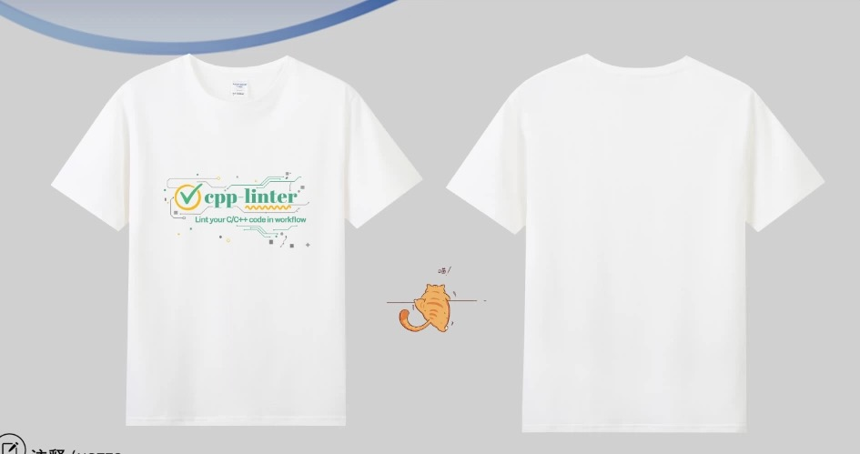
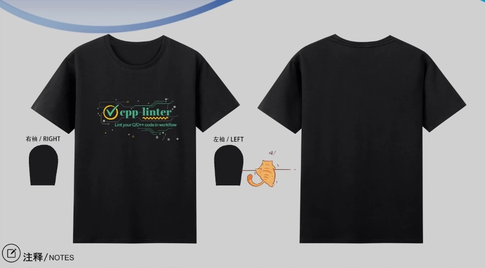
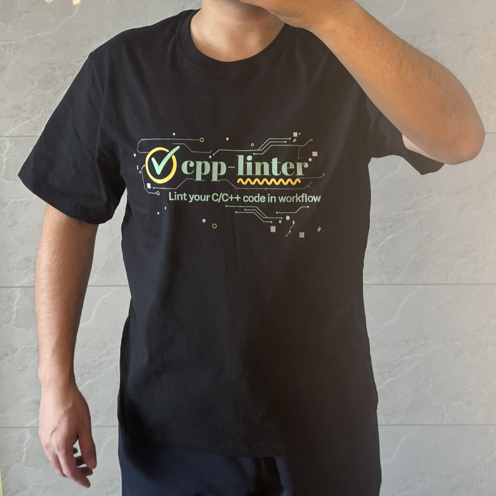

# cpp-linter Merchandise

Show your support for cpp-linter with our official T-shirts!

## About These T-Shirts

These aren't for sale — just something we made for ourselves to wear and promote this open source project. If you've used cpp-linter, appreciate the open source approach, or want to support the project, consider getting one.

### White Edition

{: style="max-width: 100%; border-radius: 8px;"}

**Features:**

- "cpp linter" logo with circuit board design
- "Lint your C/C++ code in workflow" tagline

### Black Edition

{: style="max-width: 100%; border-radius: 8px;"}

**Features:**

- "cpp-linter" logo with circuit board design
- "Lint your C/C++ code in workflow" tagline

## Design Gallery

{: style="max-width: 100%; border-radius: 8px;"}

{: style="max-width: 100%; border-radius: 8px;"}

## Size Chart

!!! warning "Important: Sizes run small!"
    Please carefully check the size chart before ordering. **No returns or refunds** after shipping.

| Size | S | M | L | XL | 2XL | 3XL | 4XL | 5XL |
|------|---|---|---|----|----|-----|-----|-----|
| **Chest (cm)** | 45 | 47 | 49 | 51 | 53 | 55 | 57 | 59 |
| **Length (cm)** | 63 | 65 | 67 | 69 | 71 | 73 | 75 | 77 |
| **Sleeve (cm)** | 16 | 17 | 18 | 19 | 20 | 21 | 22 | 23 |
| **Shoulder (cm)** | 40 | 42 | 44 | 46 | 48 | 50 | 52 | 54 |
| **Height (cm)** | 155 | 160 | 165 | 170 | 175 | 180 | 185 | 190 |
| **Weight (kg)** | 50± | 55± | 60± | 65± | 75± | 85± | 95± | 105± |

*Note: Measurements are manual and may vary by 1-3cm. Everyone's body is different, so height and weight are for reference only. Since this is a custom product, sizes cannot be changed after ordering.*

## How to Order

### For International Users

**Price: $23 USD per shirt** (includes international shipping from China)

We're currently setting up payment options for international orders. Here are the recommended options for supporting open source projects:

#### Option 1: GitHub Sponsors (Recommended)

We're in the process of setting up GitHub Sponsors for [@cpp-linter](https://github.com/cpp-linter). This allows you to:

- Support the project directly through GitHub
- Revenue will be shared between the core maintainers ([@2bndy5](https://github.com/2bndy5) and the team)
- Transparent and trusted payment processing
- Tax-compliant for open source donations

!!! tip "Coming Soon"
    GitHub Sponsors setup is in progress. Check back soon or watch our repository for updates!

#### Option 2: Buy Me a Coffee / Ko-fi

Alternative donation platforms that work well for open source projects:

- **Buy Me a Coffee**: Simple one-time or recurring donations
- **Ko-fi**: No platform fees, great for creators
- **Open Collective**: Transparent expense tracking for open source

#### Option 3: Direct Contact

For now, you can reach out to us directly:

- Open an issue on [GitHub](https://github.com/cpp-linter/cpp-linter.github.io/issues)
- Contact via email (check the repository for contact info)

!!! note "Revenue Sharing"
    All proceeds from merchandise sales are shared between the core development team, particularly [@2bndy5](https://github.com/2bndy5) who has been instrumental in developing cpp-linter.

### For Chinese Users (中国用户)

**价格：38元/件**

请关注微信公众号 **《DevOps攻城狮》** 进行下单。

!!! info "说明"

    不是为了卖货，只是自己平时穿，宣传一下我们的开源项目，就顺手多做了几件。
    
    如果你用过、关注过这个项目，认同这种开源方式，或是想支持我们，可以考虑支持一件。
    
    **38 元 / 件**
    
    尺码偏小，请一定要先参考尺码表再下单。订单发货后不支持退货及退款，请谨慎下单。

## Shipping & Returns

- **Chinese Domestic Orders**: Ships within China
- **International Orders**: Ships from China (allow 2-4 weeks for delivery)
- **No Returns/Refunds**: Due to the custom nature of these products, we cannot accept returns or provide refunds after shipping
- **Size Carefully**: Please double-check the size chart before ordering!

## Support the Project

Not interested in merchandise but want to support cpp-linter? Here are other ways:

- ⭐ Star our [GitHub repository](https://github.com/cpp-linter)
- 🐛 Report bugs and suggest features
- 💻 Contribute code or documentation
- 📢 Share cpp-linter with your network
- 💬 Help others in discussions and issues

---

*Thank you for supporting cpp-linter! Every purchase helps maintain and improve this open source project.*
