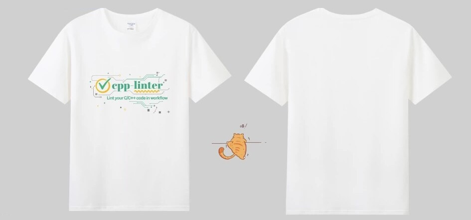
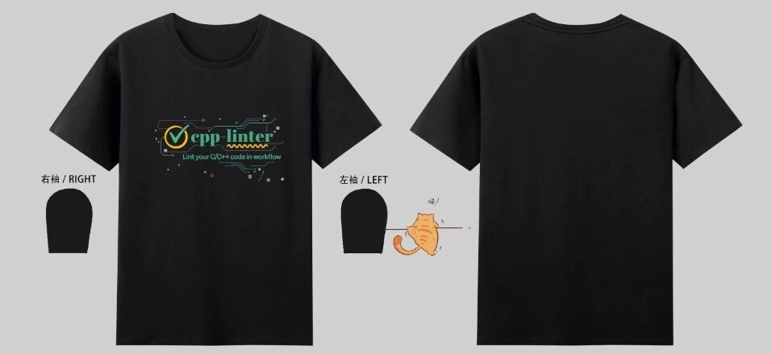
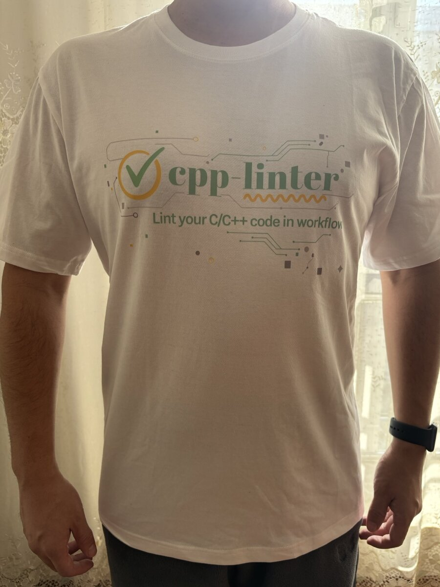
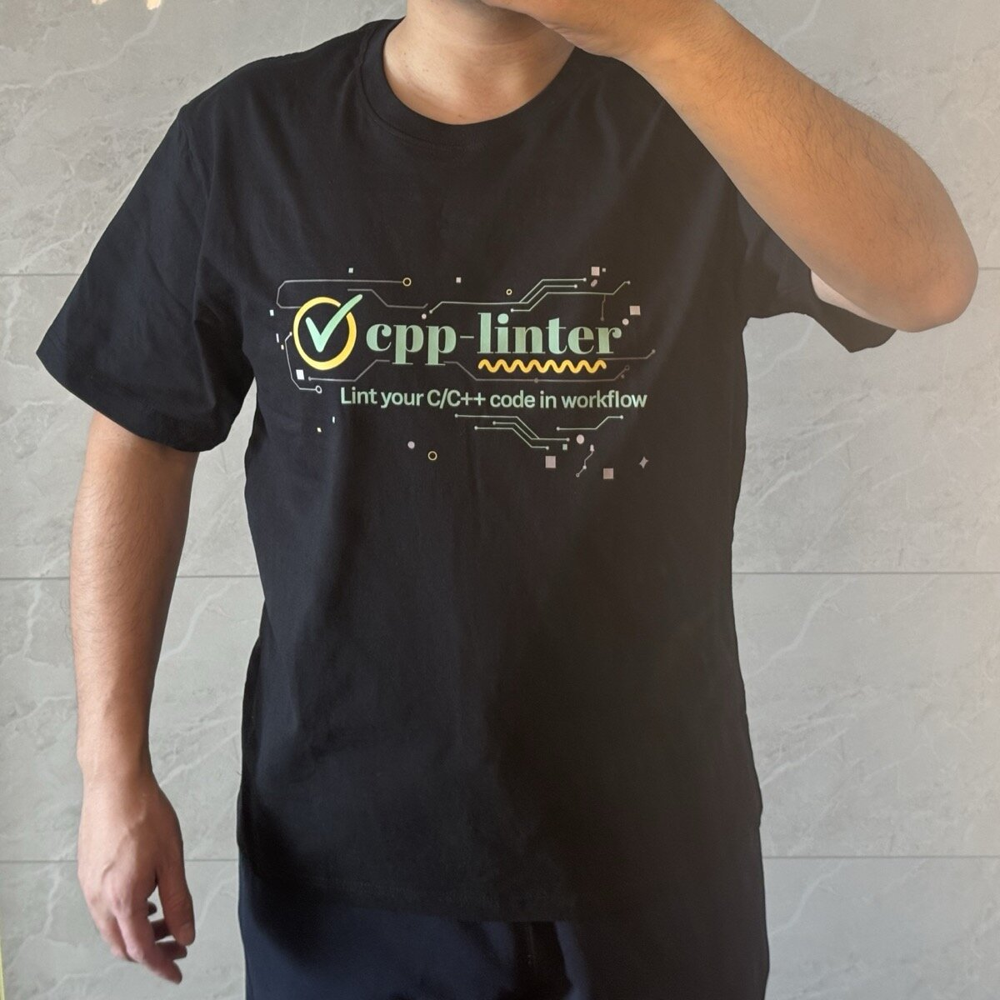

# T-shirt Thank-You

We are not selling T-shirts.

The T-shirt is our way of saying thank you to people who support the project. If your cumulative donations on [Open Collective](https://opencollective.com/cpp-linter) reach **USD 100**, we will reach out personally and send you one.

## About These T-Shirts

These aren't for sale — just something we made for ourselves to wear and promote this open source project. If you've used cpp-linter, appreciate the open source approach, or want to support the project, consider getting one.

### White Edition

{: style="max-width: 100%; border-radius: 8px;"}

**Features:**

- "cpp linter" logo with circuit board design
- "Lint your C/C++ code in workflow" tagline

### Black Edition

{: style="max-width: 100%; border-radius: 8px;"}

**Features:**

- "cpp-linter" logo with circuit board design
- "Lint your C/C++ code in workflow" tagline

### Design Gallery

{: style="max-width: 100%; border-radius: 8px;"}

{: style="max-width: 100%; border-radius: 8px;"}

### Size Chart

!!! warning "Important: Sizes run small!"
    Please carefully check the size chart before ordering. **No returns or refunds** after shipping.

| Size | S | M | L | XL | 2XL | 3XL | 4XL | 5XL |
|------|---|---|---|----|----|-----|-----|-----|
| **Chest (cm)** | 45 | 47 | 49 | 51 | 53 | 55 | 57 | 59 |
| **Length (cm)** | 63 | 65 | 67 | 69 | 71 | 73 | 75 | 77 |
| **Sleeve (cm)** | 16 | 17 | 18 | 19 | 20 | 21 | 22 | 23 |
| **Shoulder (cm)** | 40 | 42 | 44 | 46 | 48 | 50 | 52 | 54 |
| **Height (cm)** | 155 | 160 | 165 | 170 | 175 | 180 | 185 | 190 |
| **Weight (kg)** | 50± | 55± | 60± | 65± | 75± | 85± | 95± | 105± |

*Note: Measurements are manual and may vary by 1-3cm. Everyone's body is different, so height and weight are for reference only. Since this is a custom product, sizes cannot be changed after ordering.*

## How to support

[Support cpp-linter on Open Collective](https://opencollective.com/cpp-linter){ .md-button .md-button--primary }

All contributions go to the project as a whole — not to any single maintainer — and all income and expenses are publicly visible.

## How the T-shirt works

1. Donate through [Open Collective](https://opencollective.com/cpp-linter).
2. When your cumulative donations reach **USD 100**, we will contact you to arrange shipping.
3. We confirm each shipment manually and collect your size and address at that point.

Availability depends on stock, sizing, and shipping at the time — but we will always let you know before anything is sent.

Have questions? Start a [GitHub Discussion](https://github.com/cpp-linter/cpp-linter/discussions) or open an [issue](https://github.com/cpp-linter/cpp-linter.github.io/issues).

Thanks for supporting cpp-linter!
