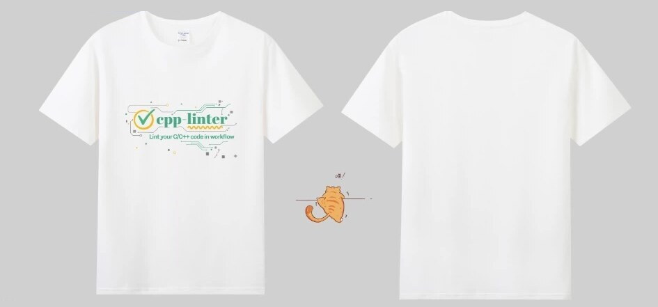
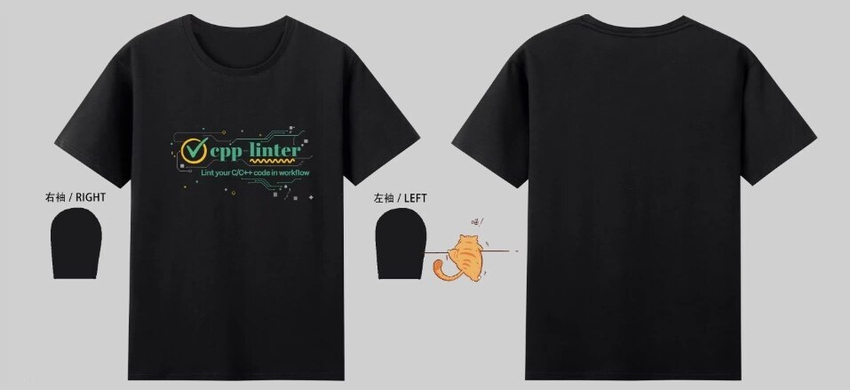
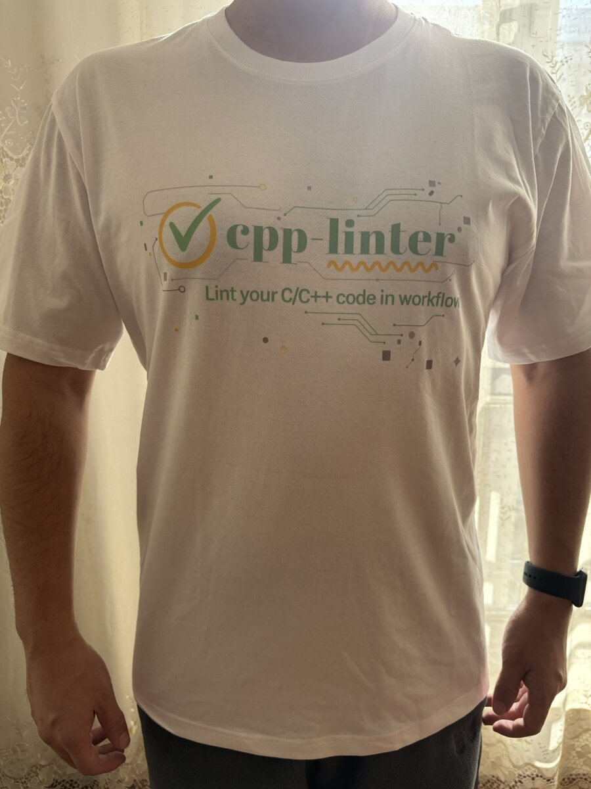
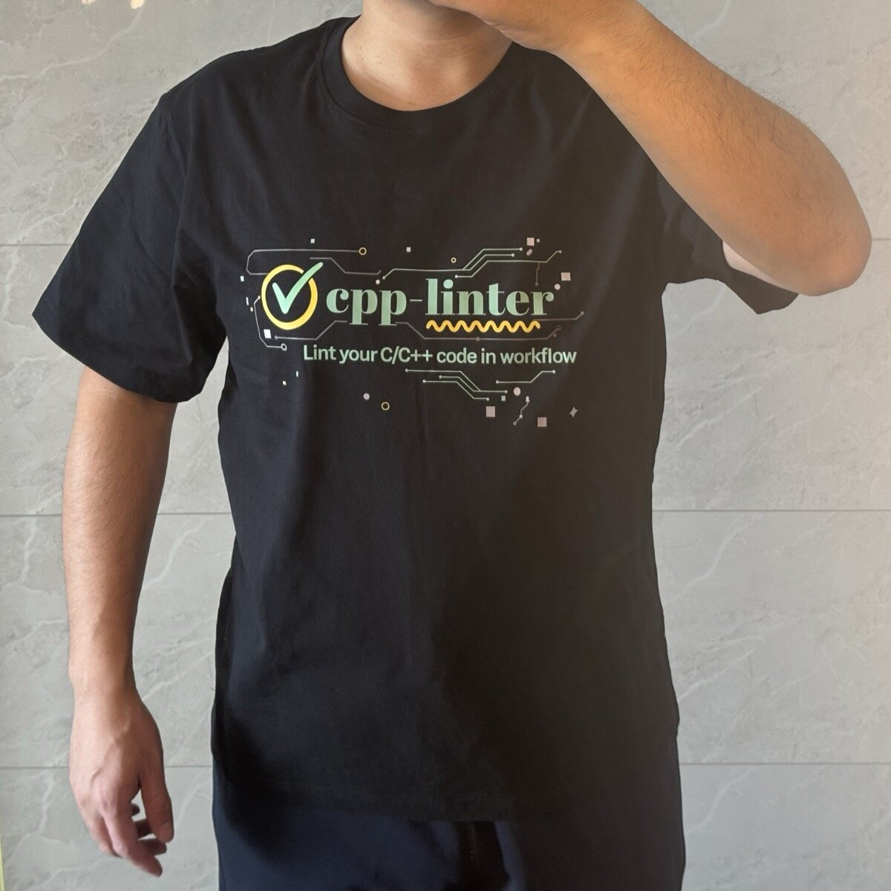

# Sponsor cpp-linter

cpp-linter is free and maintained by two volunteers. If you find it valuable, consider supporting
the project.

## How to sponsor

[Sponsor on GitHub](https://github.com/sponsors/cpp-linter){ .md-button .md-button--primary }
[Sponsor on Open Collective](https://opencollective.com/cpp-linter){ .md-button }

Both go to the project as a whole, not to any single maintainer. Open Collective income and
expenses are publicly visible.

## Sponsor tiers

| Tier | Per month | What you get |
| --- | :---: | --- |
| **Backer** | USD 5 | Your name on this page |
| **Bronze** | USD 50 | Your logo on this page and thanks in every release note while you sponsor |
| **Silver** | USD 200 | Everything in Bronze, plus your logo on the [home page](index.md) and in the READMEs of cpp-linter-action, cpp-linter, cpp-linter-rs and cpp-linter-hooks |
| **Gold** | USD 500 | Everything in Silver, with a larger logo placed first |

- Tiers are monthly. Yearly and one-time payments count at their monthly equivalent for the
  months they cover; for example, a one-time USD 600 is Silver for three months.
- Logos link to your website. We add them by hand, so allow a few days after you sponsor, and
  review the list once a quarter: logos stay until the quarter after a sponsorship ends.
- Past sponsors stay listed by name on this page, and release notes keep the thanks they gave.
- To change the name, logo or link we show, open an
  [issue](https://github.com/cpp-linter/cpp-linter.github.io/issues) or contact us through the
  platform you sponsor on.

## Sponsors

No sponsors yet. [Your logo could be here](https://github.com/sponsors/cpp-linter).

## T-shirt perk

Sponsors who give USD 100 or more in total, on any tier or as one-time donations, can claim one
cpp-linter T-shirt.

1. Sponsor through [GitHub Sponsors](https://github.com/sponsors/cpp-linter) or
   [Open Collective](https://opencollective.com/cpp-linter).
2. Once your sponsorship reaches **USD 100** in total, email us or message us on the platform you
   sponsor on with your size and shipping address.
3. We check the total and ship it. One T-shirt per sponsor.

Availability depends on stock, sizing and shipping at the time, but we will always let you know
before anything is sent.

## About the T-shirts

These aren't for sale; we made them for ourselves to wear and to promote this open-source project.

### White edition

{: style="max-width: 100%; border-radius: 8px;"}

### Black edition

{: style="max-width: 100%; border-radius: 8px;"}

Both colors have the cpp-linter logo on a circuit-board pattern with the tagline "Lint your C/C++
code in workflow" on the front, and a cat on the left sleeve.

### Design gallery

{: style="max-width: 100%; border-radius: 8px;"}

{: style="max-width: 100%; border-radius: 8px;"}

### Size chart

!!! warning "Sizes run small"
    Check the chart before you send us your size. We can't exchange a shirt after it ships.

| Size | S | M | L | XL | 2XL | 3XL | 4XL | 5XL |
| --- | :---: | :---: | :---: | :---: | :---: | :---: | :---: | :---: |
| **Chest width, laid flat (cm)** | 45 | 47 | 49 | 51 | 53 | 55 | 57 | 59 |
| **Length (cm)** | 63 | 65 | 67 | 69 | 71 | 73 | 75 | 77 |
| **Sleeve length (cm)** | 16 | 17 | 18 | 19 | 20 | 21 | 22 | 23 |
| **Shoulder width (cm)** | 40 | 42 | 44 | 46 | 48 | 50 | 52 | 54 |
| **Height (cm)** | 155 | 160 | 165 | 170 | 175 | 180 | 185 | 190 |
| **Weight (kg)** | 50± | 55± | 60± | 65± | 75± | 85± | 95± | 105± |

*Measurements are taken by hand and may vary by 1 to 3 cm. Height and weight are only a guide.*

## Questions

Start a [GitHub Discussion](https://github.com/cpp-linter/cpp-linter/discussions) or open an
[issue](https://github.com/cpp-linter/cpp-linter.github.io/issues). Thanks for supporting
cpp-linter!
